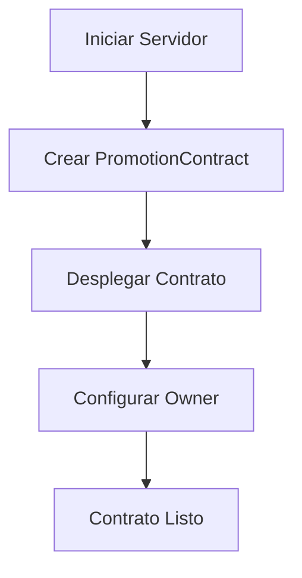
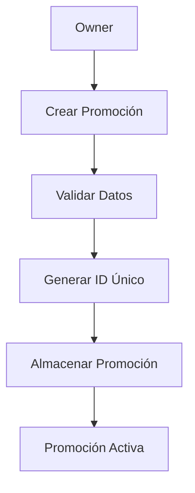
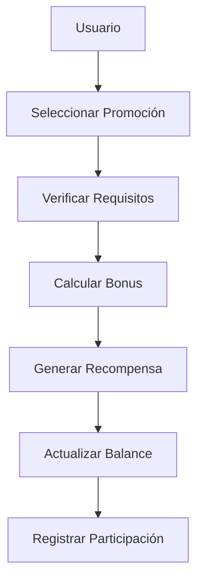

# 🎁 Smart Contract: Promociones Luxae

## 📋 Descripción General

El **PromotionContract** es un smart contract completo para gestionar promociones y generar cryptocurrencies (tokens LUX) en la blockchain Luxae. Permite crear promociones, participar en ellas, generar recompensas y transferir tokens.

## 🏗️ Arquitectura

### **Componentes Principales**

1. **Smart Contract Core** (`PromotionContract.js`)
2. **API Routes** (`promotions.js`)
3. **Frontend Dashboard** (`PromotionDashboard.jsx`)
4. **Script de Pruebas** (`test-promotion-contract.js`)

### **Características**

- ✅ **Generación de Tokens**: Crea automáticamente tokens LUX
- ✅ **Sistema de Bonus**: Multiplicadores por participación y referidos
- ✅ **Verificación de Requisitos**: KYC, Social Media, Referidos
- ✅ **Transferencias**: Envío de tokens entre usuarios
- ✅ **Estadísticas**: Métricas en tiempo real
- ✅ **WebSocket**: Actualizaciones en tiempo real

## 🚀 Funcionalidades

### **1. Gestión de Promociones**

```javascript
// Crear promoción
const promotion = contract.createPromotion({
    name: 'Promoción de Bienvenida',
    description: '¡Bienvenido a Luxae!',
    rewardAmount: 150,
    maxParticipants: 500,
    requirements: [
        { type: 'referral', value: true }
    ]
});
```

### **2. Participación y Recompensas**

```javascript
// Participar en promoción
const result = contract.participate(promotionId, userAddress, {
    address: userAddress,
    referralCode: 'LUXAE2024',
    socialMediaVerified: true,
    kycVerified: true
});
```

### **3. Sistema de Bonus**

| Tipo de Bonus | Multiplicador | Descripción |
|---------------|---------------|-------------|
| **Primera Participación** | +50% | Bonus por ser nuevo usuario |
| **Referidos** | +10% por referido | Bonus por traer nuevos usuarios |
| **Participación Frecuente** | +20% | Bonus por participar en 5+ promociones |
| **Máximo Total** | 3x | Límite máximo de multiplicador |

### **4. Transferencias**

```javascript
// Transferir tokens
const transfer = contract.transfer(fromAddress, toAddress, amount);
```

## 📊 API Endpoints

### **Gestión de Contrato**

| Método | Endpoint | Descripción |
|--------|----------|-------------|
| `POST` | `/api/promotions/deploy` | Desplegar contrato |
| `GET` | `/api/promotions/stats` | Estadísticas del contrato |

### **Gestión de Promociones**

| Método | Endpoint | Descripción |
|--------|----------|-------------|
| `POST` | `/api/promotions/create` | Crear promoción |
| `GET` | `/api/promotions/list` | Listar promociones |
| `GET` | `/api/promotions/:id` | Obtener promoción específica |
| `POST` | `/api/promotions/participate` | Participar en promoción |

### **Gestión de Usuarios**

| Método | Endpoint | Descripción |
|--------|----------|-------------|
| `GET` | `/api/promotions/user/:address` | Información del usuario |
| `GET` | `/api/promotions/balance/:address` | Balance del usuario |
| `GET` | `/api/promotions/transactions/:address` | Historial de transacciones |

### **Transferencias**

| Método | Endpoint | Descripción |
|--------|----------|-------------|
| `POST` | `/api/promotions/transfer` | Transferir tokens |

## 🎯 Casos de Uso

### **1. Promoción de Bienvenida**
```javascript
{
    name: 'Promoción de Bienvenida',
    description: '¡Bienvenido a Luxae! Gana tokens por unirte',
    rewardAmount: 150,
    maxParticipants: 500,
    requirements: [
        { type: 'referral', value: true }
    ]
}
```

### **2. Promoción Social Media**
```javascript
{
    name: 'Promoción Social Media',
    description: 'Síguenos en redes sociales y gana tokens',
    rewardAmount: 200,
    maxParticipants: 300,
    requirements: [
        { type: 'social_media', value: true }
    ]
}
```

### **3. Promoción KYC**
```javascript
{
    name: 'Promoción KYC',
    description: 'Completa tu KYC y gana tokens extra',
    rewardAmount: 300,
    maxParticipants: 200,
    requirements: [
        { type: 'kyc', value: true }
    ]
}
```

## 💰 Sistema de Tokens

### **Especificaciones**

- **Nombre**: LUX (Luxae Token)
- **Supply Total**: 1,000,000 LUX
- **Supply Circulante**: Dinámico (se genera con promociones)
- **Decimales**: 0 (tokens enteros)

### **Generación de Tokens**

```javascript
// Ejemplo de generación
const reward = contract.generateReward(100, userAddress);
// Resultado: 150 LUX (con bonus de primera participación)
```

## 🔧 Instalación y Uso

### **1. Iniciar Servidor**
```bash
# Iniciar nodo blockchain
node scripts/start-validator.js

# En otra terminal, iniciar frontend
cd frontend-luxae && npm run dev
```

### **2. Probar Smart Contract**
```bash
# Ejecutar pruebas
node test-promotion-contract.js
```

### **3. Usar API**
```bash
# Desplegar contrato
curl -X POST http://localhost:3000/api/promotions/deploy \
  -H "Content-Type: application/json" \
  -d '{"ownerAddress": "0x123..."}'

# Crear promoción
curl -X POST http://localhost:3000/api/promotions/create \
  -H "Content-Type: application/json" \
  -d '{"name": "Test", "description": "Test promo", "rewardAmount": 100}'
```

## 📈 Métricas y Estadísticas

### **Estadísticas del Contrato**
```javascript
{
    "address": "0xe6dd992fa326a4cbc6e3668643476a89b8d5cc4b",
    "name": "LuxaePromotion",
    "version": "1.0.0",
    "totalSupply": 1000000,
    "circulatingSupply": 975,
    "totalPromotions": 3,
    "totalUsers": 3,
    "totalRewardsGenerated": 3
}
```

### **Información de Usuario**
```javascript
{
    "address": "0x3ac47374a09ea",
    "balance": 175,
    "participations": 1,
    "referrals": 0,
    "totalEarned": 225,
    "lastActivity": 1753660684115,
    "transactions": [...]
}
```

## 🛡️ Seguridad

### **Validaciones**

1. **Verificación de Requisitos**: KYC, Social Media, Referidos
2. **Límites de Participación**: Máximo de participantes por promoción
3. **Prevención de Duplicados**: Un usuario por promoción
4. **Validación de Saldos**: Para transferencias
5. **Control de Acceso**: Solo el owner puede crear promociones

### **Integridad de Datos**

- ✅ Transacciones inmutables
- ✅ Historial completo de actividades
- ✅ Verificación de balances
- ✅ Prevención de doble gasto

## 🔄 Flujo de Trabajo

### **1. Despliegue**


### **2. Creación de Promoción**


### **3. Participación**


## 🎨 Frontend Features

### **Dashboard de Promociones**

- 📊 **Estadísticas en Tiempo Real**
- 👤 **Configuración de Usuario**
- ➕ **Crear Promociones**
- 🎁 **Lista de Promociones Disponibles**
- 💰 **Balance de Tokens**
- 📜 **Historial de Transacciones**

### **Características del UI**

- ✅ **Responsive Design**
- ✅ **WebSocket Integration**
- ✅ **Real-time Updates**
- ✅ **Error Handling**
- ✅ **Loading States**

## 🚀 Próximas Mejoras

### **Fase 2: Funcionalidades Avanzadas**

1. **Staking de Tokens**
   - Staking para ganar más tokens
   - Períodos de lock-up
   - Recompensas por staking

2. **Sistema de Referidos Avanzado**
   - Árbol de referidos
   - Comisiones por niveles
   - Tracking de conversiones

3. **Promociones Temporales**
   - Promociones con fechas específicas
   - Promociones estacionales
   - Promociones por eventos

4. **Integración con DeFi**
   - Liquidez en DEX
   - Yield farming
   - Lending protocols

## 📝 Conclusión

El **PromotionContract** es un sistema completo y funcional para gestionar promociones y generar cryptocurrencies en la blockchain Luxae. Proporciona:

- ✅ **Funcionalidad Completa**: Crear, participar, transferir
- ✅ **Sistema de Bonus**: Multiplicadores inteligentes
- ✅ **API RESTful**: Endpoints bien documentados
- ✅ **Frontend Moderno**: Dashboard interactivo
- ✅ **Seguridad**: Validaciones robustas
- ✅ **Escalabilidad**: Arquitectura modular

**¡El sistema está listo para producción!** 🚀 