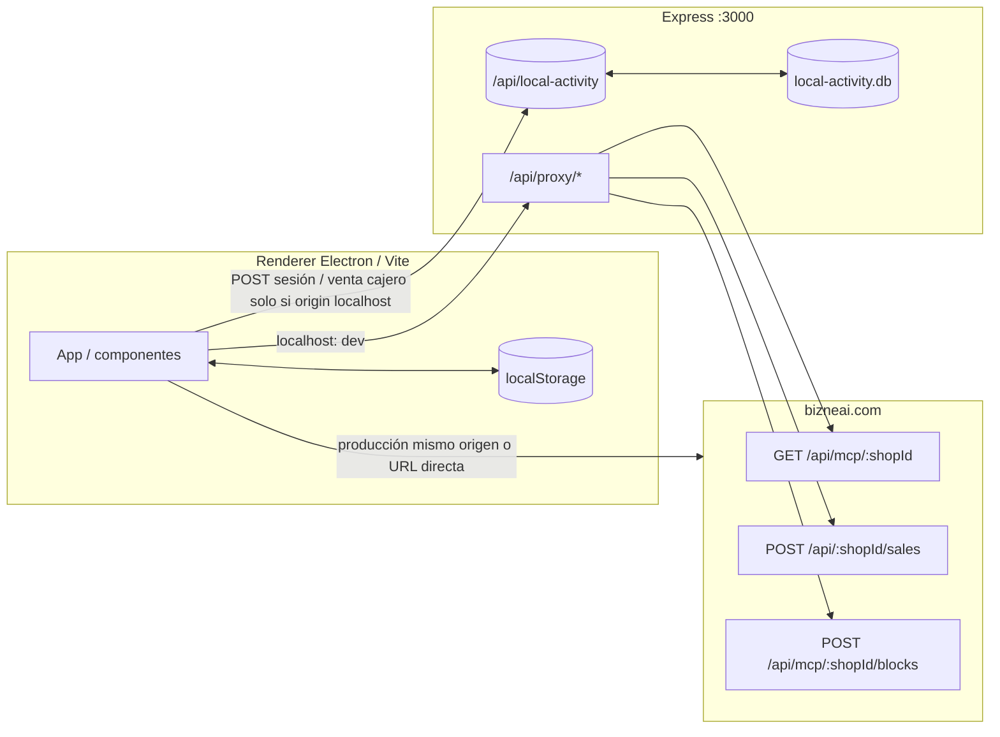

# Base de datos local y replicación hacia la API

Este documento describe dónde persisten los datos del POS de escritorio, cómo se leen del backend BizneAI (`https://www.bizneai.com`) y qué caminos usan las escrituras. El origen de verdad remoto es la API/MCP del shop; el cliente prioriza **continuidad offline** con `localStorage` y, en un caso concreto, **SQLite en el servidor Express local**.

## Visión general

| Capa | Tecnología | Rol |
|------|------------|-----|
| Cliente (renderer) | `localStorage` | Catálogo, carrito, configuración, Merkle, clientes, cocina, waitlist, roles/bloqueo, etc. |
| Servidor local (`npm run dev:server`) | SQLite (`better-sqlite3`) | Registro de sesión (PIN) y ventas por cajero; **no** sustituye al catálogo en `localStorage` |
| API remota | HTTPS | Ventas (`POST /api/:shopId/sales`), catálogo e información del shop vía MCP (`GET /api/mcp/:shopId`), bloques Merkle (`POST /api/mcp/:shopId/blocks`) |

En **desarrollo** (`localhost:5173`), las peticiones al dominio remoto suelen ir a través del **proxy** del servidor en el puerto **3000** (`/api/proxy/...`) para evitar CORS.

### better-sqlite3: `npm install`, setup y cuándo corre

- **`npm install`** descarga o compila el binario nativo de `better-sqlite3` para el **Node** que ejecutó el install. No abre ningún `.db` hasta que el servidor Express ejecute código que llame a `getLocalActivityDb()` (p. ej. un `POST` a `/api/local-activity/...`).
- El **asistente de configuración (setup)** de la app solo escribe en **`localStorage`**; no inicializa SQLite.
- **`npm run fix-deps`** (usado antes de builds) ejecuta `electron-rebuild` sobre `better-sqlite3` para **Electron** empaquetado; el API local en desarrollo corre con **`tsx` + Node**, no con el runtime de Electron.
- La app **Electron empaquetada** no arranca Express en `electron/main.js`; si no levantas la API por separado, **`local-activity.db` no se usa** en esa sesión (la actividad queda en `localStorage`).

Tabla detallada y contexto: sección *Instalación y ejecución de better-sqlite3* en [DATABASE_SYSTEM.md](../DATABASE_SYSTEM.md).

## Identidad del shop (`shopId`)

El `shopId` (y URLs MCP) se resuelven en el cliente desde:

- `bizneai-server-config` (prioridad)
- `bizneai-store-identifiers` (fallback, incl. `clientId`)

Código: `src/utils/shopIdHelper.ts`.

Sin shop configurado, parte de la lógica remota no corre; el registro de actividad local usa el placeholder `local-unconfigured` (`getActivityShopId()` en `src/services/localActivityLog.ts`).

## Catálogo de productos (remoto → local)

1. **Origen remoto:** respuesta MCP agregada en `GET` al endpoint MCP del shop (en dev: `http://localhost:3000/api/proxy/mcp/:shopId`, que reenvía a `https://www.bizneai.com/api/mcp/:shopId`).
2. **Enriquecimiento:** `getProductsFromMcp` en `shopIdHelper.ts` puede combinar datos con la API de productos del shop para imágenes y metadatos.
3. **Destino local:** lista normalizada y fusionada guardada en **`bizneai-products`** (`localStorage`).
4. **Fusión:** `mergeProductsFromServerPreserveImages` mantiene la imagen local si el remoto no trae URL, y evita sobrescribir filas locales cuando la huella de datos/`updatedAt` coincide con el servidor (misma “versión” lógica).

**Sincronización en segundo plano:** `src/utils/syncService.ts` — si pasaron ~24 h (`bizneai-last-sync`), intenta `runBackgroundSync` (MCP + merge + evento `products-updated`). La carga manual desde Configuración sigue el mismo patrón de fetch + merge.

## Ventas (local → API remota)

- **Escritura principal:** `createSale` en `src/api/sales.ts` hace `POST` con payload `ShopTransaction` (incluye `clientEventId` nuevo por intento para idempotencia en servidor).
- **URL en dev:** `http://localhost:3000/api/proxy/sales/:shopId` → el proxy reenvía el cuerpo a `https://www.bizneai.com/api/:shopId/sales` (`server/src/routes/mcpProxyRoutes.ts`).
- **URL fuera de localhost:** se llama directamente a `https://www.bizneai.com/api/:shopId/sales`.

Tras una venta exitosa, la app puede registrar:

- **Merkle:** `recordSaleCreation` → `localStorage` bajo claves `@BizneAI_*` (`src/services/merkleTreeService.ts`).
- **Cajero / sesión:** `recordSaleCashier` → `localStorage` (`bizneai-local-activity-sales`) y, si el origen es localhost, **duplicado** en SQLite vía `POST /api/local-activity/sale`.

## Bloques Merkle (local → API remota)

- Transacciones y bloques diarios viven en **`localStorage`** (`merkleTreeService.ts`).
- Envío al servidor: `sendBlockToServer` en `src/services/blockApiService.ts`.
  - Dev: `POST http://localhost:3000/api/proxy/blocks/:shopId` → `https://www.bizneai.com/api/mcp/:shopId/blocks`.
- Los bloques ya enviados se marcan en `@BizneAI_blocks_sent_to_server`; `syncUnsentBlocksToServer` reintenta los pendientes.

Documentación de lógica Merkle adicional en el archivo de proyecto `# Merkle Tree Sales – Lógica Completa y .md` (raíz del repo).

## Actividad local (sesión PIN + venta por cajero)

Objetivo: auditoría en máquina sin depender solo del navegador.

| Persistencia | Detalle |
|--------------|---------|
| `localStorage` | `bizneai-local-activity-sessions`, `bizneai-local-activity-sales` (máx. ~3000 filas por lista) |
| SQLite | `server/data/local-activity.db` — tablas `session_events`, `sale_cashier_events` |

Flujo (`src/services/localActivityLog.ts`):

- Cada evento se escribe **siempre** en `localStorage`.
- Si `window.location.origin` es **localhost**, además se hace `POST` a `/api/local-activity/session` o `/api/local-activity/sale`.
- En **build de producción** cargada sin origen localhost, **solo** queda la copia en `localStorage` (el `baseUrl` del cliente para actividad es vacío).

Lecturas combinadas: `fetchSessionEventsMerged` / `fetchSaleCashierMerged` unen respuestas `GET /api/local-activity/sessions|sales?shopId=` con las filas locales.

Rutas servidor: `server/src/routes/localActivityRoutes.ts`, persistencia: `server/src/localActivityDb.ts`.

## Otras claves `localStorage` relevantes

| Clave (prefijo `bizneai-` salvo Merkle) | Uso |
|----------------------------------------|-----|
| `bizneai-store-config` | Nombre tienda, impuestos, `kitchenEnabled`, etc. |
| `bizneai-server-config` | `shopId`, `mcpUrl`, `serverUrl`, sincronización desde ajustes |
| `bizneai-cart`, `bizneai-cart-customer`, `bizneai-cart-notes` | Carrito |
| `bizneai-product-order-counts` | Orden / frecuencia en UI |
| `bizneai-kitchen-orders`, `bizneai-waitlist` | Cocina y lista de espera |
| `bizneai-customers-registry` | Registro de clientes del POS (no es el CRM remoto completo) |
| `bizneai-roles`, `bizneai-screen-lock-enabled`, `bizneai-passcode`, `bizneai-session-unlocked`, `bizneai-screen-lock-identity` | Bloqueo de pantalla |
| `bizneai-tax-rate`, `bizneai-fiscal-config`, `bizneai-invoices` | Pantalla fiscal / impuestos |
| `bizneai-inventory-history` | Historial local de inventario |
| `bizneai-language` | i18n |
| `@BizneAI_merkle_tree`, `@BizneAI_daily_blocks`, … | Cadena Merkle |

## Informes de ventas: varias fuentes en lectura

`src/utils/salesRecovery.ts` y `SalesReports` combinan:

- Transacciones **MCP** (`getTransactionsFromMcp` / datos del shop remoto).
- Filas derivadas del **Merkle** local (`mapMerkleTransactionToSaleRow`).
- Reglas de deduplicación (`mergeSaleRows`).

No es una “replicación” unidireccional: es **vista unificada** de lo remoto y lo registrado en cliente.

## Proxy de desarrollo (`/api/proxy`)

Definido en `server/src/routes/mcpProxyRoutes.ts`. Incluye entre otros:

- `GET /api/proxy/mcp/:shopId` — datos MCP del shop.
- `POST /api/proxy/sales/:shopId` — ventas.
- `POST /api/proxy/blocks/:shopId` — bloques Merkle.
- Rutas adicionales para métodos MCP, etc.

Montaje en `server/src/index.ts`: `app.use('/api/proxy', mcpProxyRoutes)`.

## SQLite `bizneai.db` en el código del cliente (no activo)

En `src/database/database.ts` hay un `DatabaseManager` con **better-sqlite3** orientado a `bizneai.db` (cwd en dev, `userData` en Electron si se usara desde el proceso adecuado). **`src/server/databaseRoutes.ts` no está montado** en `server/src/index.ts`. El hook **`useDatabase`** no importa ese módulo: expone operaciones como **stubs** (sin SQLite real en el renderer). El POS actual no usa este fichero para el catálogo ni las ventas diarias.

Esquema de tablas previstas y estado del proyecto: [DATABASE_SYSTEM.md](../DATABASE_SYSTEM.md).

## Resumen de “replicación”

| Dirección | Qué | Mecanismo |
|-----------|-----|-----------|
| API → cliente | Productos, datos de shop, transacciones MCP | `fetch` MCP/proxy + merge → `localStorage` |
| Cliente → API | Venta | `POST` Sales API (proxy en dev) |
| Cliente → API | Bloque diario Merkle | `POST` blocks (proxy en dev) |
| Cliente → servidor local | Actividad PIN/venta cajero | `POST` `/api/local-activity/*` + SQLite (solo si origin localhost en el cliente) |
| Cliente | Copia de seguridad actividad | Siempre `localStorage` |

## Archivos de referencia

| Archivo | Tema |
|---------|------|
| `src/utils/shopIdHelper.ts` | `shopId`, URL MCP, productos, transacciones MCP |
| `src/utils/syncService.ts` | Sync periódica de catálogo |
| `src/api/sales.ts` | Envío de ventas a la API |
| `src/services/merkleTreeService.ts` | Persistencia Merkle en `localStorage` |
| `src/services/blockApiService.ts` | Envío de bloques |
| `src/services/localActivityLog.ts` | Dual-write actividad |
| `server/src/localActivityDb.ts` | Esquema SQLite actividad |
| `server/src/routes/mcpProxyRoutes.ts` | Proxy hacia bizneai.com |
| `docs/# Datos enviados al servidor y endpoints.md` | Detalle de payloads/endpoints (si está actualizado en tu copia) |

---

*Última revisión alineada con el código del monorepo (abril 2026).*
